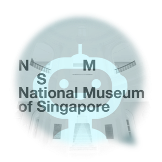

## SECTION 1 : PROJECT TITLE
## Mini Museum Chatbot - Cognitive System 

---
## SECTION 2 : EXECUTIVE SUMMARY / PAPER ABSTRACT
This report is to introduce a chatbot system for the National Museum of Singapore. National Museum of Singapore is the nation's oldest museum that seeks to inspire with stories of Singapore and the world. It offers a wide range of exhibitions and programmes for visitors of all ages and group size. Every year, many tourists go there to visit various excellent exhibitions and experience exciting programmes. 

However, the official website of the National Museum of Singapore does not provide excellent guidance and introduction to various exhibitions and programmes. The reason is that the majority of the information on its website is relatively simple and not classified. Furthermore, major travel information providers, like Tripadvisor and DianPing.com, are more inclined to provide more comprehensive recommendation and introduction services for popular tourist attractions than the less attractive destination like museums.

Our team consists of two Chinese students. We hope that all tourists can have a fascinating and enjoyable journey in the National Museum of Singapore, so we decide to create a system to let tourists get accurate and customised information more conveniently, and tourists can communicate with it using natural language. 

The system is the Mini Museum, an intelligent chatbot. Tourist can use Google assistant to talk with it for fundamental information, even getting the recommendation of exhibitions and programmes based on their travel plan in the National Museum of Singapore.

To complete this intelligent chatbot, our group first set out to investigate the National Museum of Singapore's Website to get an overall understanding of it. For data collection, we used Python Selenium to scrape data from the official website, and then we pre-labelled and pre-processed the data and stored it into an excel file. For chatbot agent implementation, we used the techniques imparted to us in lectures and did some extension. We used Google DialogFlow to identify the users' intent, Flask as the backend of the chatbot to provide the relevant response, the Google Assistant (Action on Google) as the frontend to interact with users. Tourists can communicate with the Mini Museum anywhere anytime if they can use Google Assistant.

Our team had an exciting time working on this project, hoping to attract more and more people for the Nation Museum of Singapore by getting them a better service and user experience. It is widely different from a complicated intelligent agent which can communicate with tourists and tourists can never tell any difference between it and a real human volunteer or museum staff. We are looking forward that we can have the opportunity and technique to build an actual intelligent agent in the future. The process of working on this project is exciting and helpful for us to learn more in the NLP field.

---
## SECTION 3 : CREDITS / PROJECT CONTRIBUTION

| Official Full Name  | Student ID (MTech Applicable)  | Work Items (Who Did What) | Email (Optional) |
| :------------ |:---------------:| :-----| :-----|
| XU JIACHEN | A0198491M | Solution Architect Software Development Documentation| e0402032@u.nus.edu |
| LI XINLIN | A0198535N | Data mining Data solution design Software Development Project Video| e0402076@u.nus.edu |

---
## SECTION 4 : VIDEO OF SYSTEM MODELLING & USE CASE DEMO

---
## SECTION 5 : USER GUIDE

`<Github File Link>` : <https://github.com/telescopeuser/Workshop-Project-Submission-Template/blob/master/UserGuide/User%20Guide%20HDB-BTO.pdf>

---
## SECTION 6 : PROJECT REPORT / PAPER

`<Github File Link>` : <https://github.com/telescopeuser/Workshop-Project-Submission-Template/blob/master/ProjectReport/Project%20Report%20HDB-BTO.pdf>

**Recommended Sections for Project Report / Paper:**
- Executive Summary
- Problem Description (Background Description and Business Analysis)
- Solution (System Architecture and Process Flow)
- Data Extraction and Improvement
- Implementation (including the Set up process and Challenge ans those solutions)
- Conclusion
- Bibliography
- APPENDICES

---
## SECTION 7 : MISCELLANEOUS

### logo.png

